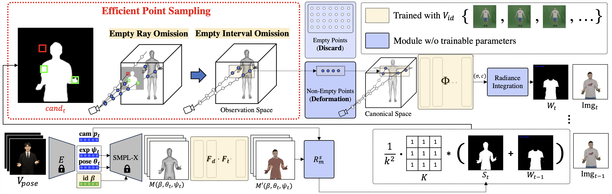

  <h1 align="center">EPSilon: Efficient Point Sampling for Lightening of Hybrid-based 3D Avatar Generation
 </h1>
  

    
  

  <h1 align="center">Abstract
 </h1>
  

The rapid advancement of neural radiance fields (NeRF) has paved the way to generate animatable human avatars from a monocular video.
However, the sole usage of NeRF suffers from a lack of details, which results in the emergence of hybrid representation that utilizes SMPL-based mesh together with NeRF representation. While hybrid-based models show photo-realistic human avatar generation qualities, they suffer from extremely slow inference due to their deformation scheme: to be aligned with the mesh, hybrid-based models use the deformation based on SMPL skinning weights, which needs high computational costs on each sampled point. We observe that since most of the sampled points are located in empty space, they do not affect the generation quality but result in inference latency with deformation. In light of this observation, we propose EPSilon, a hybrid-based 3D avatar generation scheme with novel efficient point sampling strategies that boost both training and inference. In EPSilon, we propose two methods to omit empty points at rendering; empty ray omission (ERO) and empty interval omission (EIO). In ERO, we wipe out rays that progress through the empty space. Then, EIO narrows down the sampling interval on the ray, which wipes out the region not occupied by either clothes or mesh. The delicate sampling scheme of EPSilon enables not only great computational cost reduction during deformation but also the designation of the important regions to be sampled, which enables a single-stage NeRF structure without hierarchical sampling. Compared to existing methods, EPSilon maintains the generation quality while using only 3.9% of sampled points and achieves around 20 times faster inference, together with 4 times faster training convergence.

  

## Method Overview

  

EPSiloN proposes an efficient point sampling strategies in the avatar generation based on the monocular video, which results in comparable results to the state-of-the-art models while reducing the inference latency significantly.

## Results

  

Along with the input image, we visualize the reconstructed image with RGB representation and mesh representation. Moreover, we show the depth image of the mesh, and obtained $T_n$ and $T_f$ together for the better understanding. We visualize (ground truth, rendered image, mesh representation, $D(M')$, $T_n$, $T_f$), respectively, in the figure above. $T_n$ and $T_f$ indeed find the appropriate interval using $D(M')$.

  

In the figure above, we visualize the novel view generation and novel pose generation of four subjects in People Snapshot datasets. While achieving 15 times faster rendering speed compared to the baseline, our model robustly generates the novel contents of given subjects.